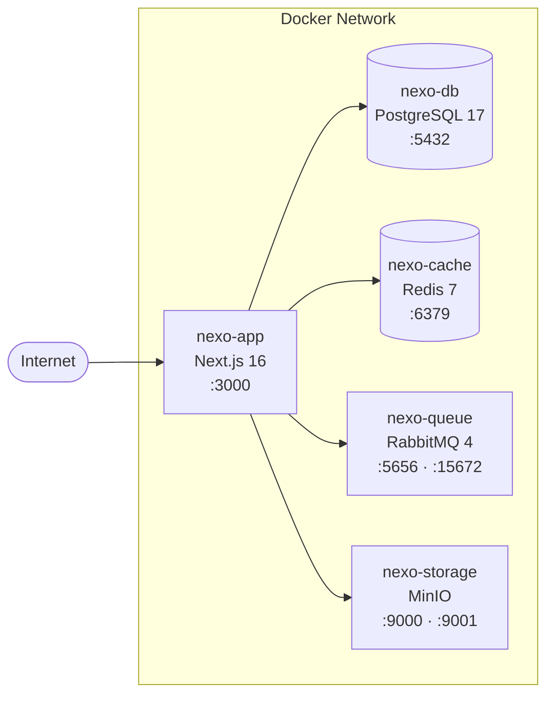
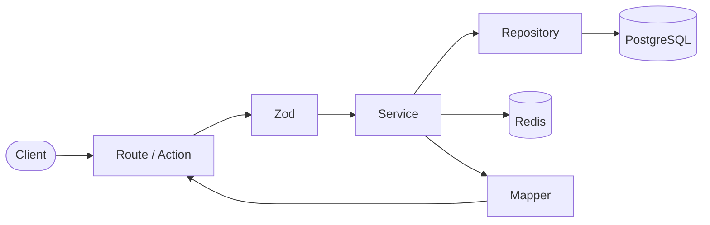

<br />

<p align="center">
  
</p>
<p align="center"><b>Project management that actually works for your team</b></p>

<p align="center">
  <a href="https://github.com/castrogusttavo/nexo/actions/workflows/ci.yml"></a>
  <a href="https://codecov.io/github/castrogusttavo/nexo"></a>
</p>

This README serves as both an introduction to Nexo and a guide to get started with development.

- New to Nexo? Start with [What is Nexo?](#what-is-nexo)
- Want to run it locally? Jump to [Getting started](#getting-started)
- Looking for the docs? Visit our [Official Documentation](https://nexo.coodee.dev/docs)
- Have feedback? Visit our [Forum](#community) or check the [Status page](#community)

## Table of contents

- [What is Nexo?](#what-is-nexo)
- [Why Nexo?](#why-nexo)
- [Features](#features)
- [Getting started](#getting-started)
  - [Prerequisites](#prerequisites)
  - [Installation](#installation)
  - [Running locally](#running-locally)
- [Tech stack](#tech-stack)
- [Architecture](#architecture)
- [Community](#community)
- [Security](#security)
- [License](#license)

## What is Nexo?

Nexo is a project management platform that brings together the best of tools like Plane, Jira, and Linear into a single, cohesive experience. It is designed for teams that need powerful issue tracking, sprint management, and product roadmaps — without the complexity and overhead of enterprise tools.

### Key capabilities

- **Issue tracking:** Create, assign, and track work items with rich text descriptions, file uploads, sub-issues, and cross-references.
- **Cycles:** Time-boxed iterations with burn-down charts and progress analytics to keep your team on pace.
- **Modules:** Break down large initiatives into focused, manageable groups of work.
- **Views:** Customizable filters and layouts — save, share, and switch between different perspectives of your project.
- **Pages:** Capture ideas and documentation with a rich text editor. Convert notes into actionable issues.
- **Analytics:** Real-time insights across projects — visualize bottlenecks, track velocity, and make data-driven decisions.
- **Workspaces:** Multi-tenant workspaces with role-based access control (Owner, Admin, Member, Viewer).

## Why Nexo?

Most project management tools force you to choose: simplicity or power. Nexo provides both.

- **Fast by design:** Built on Next.js with Turbopack and server components for instant page loads.
- **Opinionated workflows:** Cycles, modules, and views work together — not as disconnected features.
- **Clean architecture:** Service layer pattern with clear separation of concerns makes the codebase easy to navigate and extend.
- **Self-hostable:** Run on your own infrastructure with Docker. Your data stays with you.
- **Real-time observability:** Built-in Axiom integration for logs, errors, and web vitals from day one.

## Features

| Feature | Description |
|---------|-------------|
| **Issues** | Rich text editor, file uploads, sub-issues, labels, assignees, priorities |
| **Cycles** | Sprint-like iterations with burn-down charts and automated progress tracking |
| **Modules** | Group related issues into focused deliverables |
| **Views** | Filtered, saved, and shareable issue displays (table, board, timeline) |
| **Pages** | Documentation and note-taking with Markdown support |
| **Analytics** | Real-time dashboards with velocity, workload, and project health metrics |
| **Workspaces** | Multi-tenant with RBAC (Owner, Admin, Member, Viewer) |
| **API** | RESTful API with Scalar-powered interactive documentation |

## Getting started

### Prerequisites

- [Node.js](https://nodejs.org/) v20+
- [pnpm](https://pnpm.io/) v9+
- [Docker](https://www.docker.com/) (for PostgreSQL and Redis)

### Installation

1. **Clone the repository**

   ```sh
   git clone https://github.com/castrogusttavo/nexo.git
   cd nexo
   ```

2. **Install dependencies**

   ```sh
   pnpm install
   ```

3. **Set up environment variables**

   ```sh
   cp .env.example .env
   ```

   Update the `.env` file with your database credentials and other required variables.

4. **Start infrastructure** (PostgreSQL + Redis)

   ```sh
   pnpm docker:create
   ```

5. **Set up the database**

   ```sh
   pnpm prisma:generate
   pnpm prisma:migrate:dev
   ```

### Running locally

```sh
pnpm dev
```

The application will be available at `http://localhost:3000`.

### Running tests

```sh
# Unit tests
pnpm test:unit

# Integration tests (requires database)
pnpm test:integration

# All tests
pnpm test:all
```

## Tech stack

| Layer | Technology |
|-------|-----------|
| **Framework** | [Next.js 16](https://nextjs.org/) with Turbopack |
| **Language** | [TypeScript](https://www.typescriptlang.org/) |
| **Database** | [PostgreSQL](https://www.postgresql.org/) |
| **ORM** | [Prisma 7](https://www.prisma.io/) |
| **Cache** | [Redis](https://redis.io/) |
| **Auth** | [Better Auth](https://www.better-auth.com/) |
| **Validation** | [Zod](https://zod.dev/) |
| **UI** | [Shadcn UI](https://ui.shadcn.com/) + [Tailwind CSS 4](https://tailwindcss.com/) |
| **Data fetching** | [TanStack Query v5](https://tanstack.com/query) |
| **Email** | [Resend](https://resend.com/) + [React Email](https://react.email/) |
| **Observability** | [Axiom](https://axiom.co/) |
| **API docs** | [Scalar](https://scalar.com/) |
| **Linting** | [Biome](https://biomejs.dev/) |
| **Testing** | [Vitest](https://vitest.dev/) |

## Architecture

### Infrastructure



### Application layer

Nexo follows a **Service Layer Architecture** with clear separation of concerns:



- **Routes** (`app/api/`): HTTP handling only — no business logic, no direct database access.
- **Schemas** (`src/schemas/`): Zod schemas for input validation.
- **Services** (`src/services/`): All business logic and authorization.
- **Repositories** (`src/repositories/`): Database access layer — the only layer that imports Prisma.
- **Mappers** (`src/mappers/`): Transform database models into DTOs.
- **Errors** (`src/errors/`): Result pattern with typed error codes — no thrown exceptions.

For more details, see the [official documentation](https://nexo.coodee.dev/docs).

## Community

We'd love to hear from you. Use the channels below to follow updates, report bugs, or request features:

- **Forum:** Share ideas, report bugs, request features, and follow development updates on our [Forum](https://nexo.coodee.dev/forum).
- **Status:** Check real-time availability and incident history on our [Status page](https://nexo.coodee.dev/status).

## Security

If you discover a security vulnerability, please report it responsibly by emailing **security@nexo.coodee.dev** instead of opening a public issue.

## License

This project is licensed under the [GNU Affero General Public License v3.0](LICENSE).
