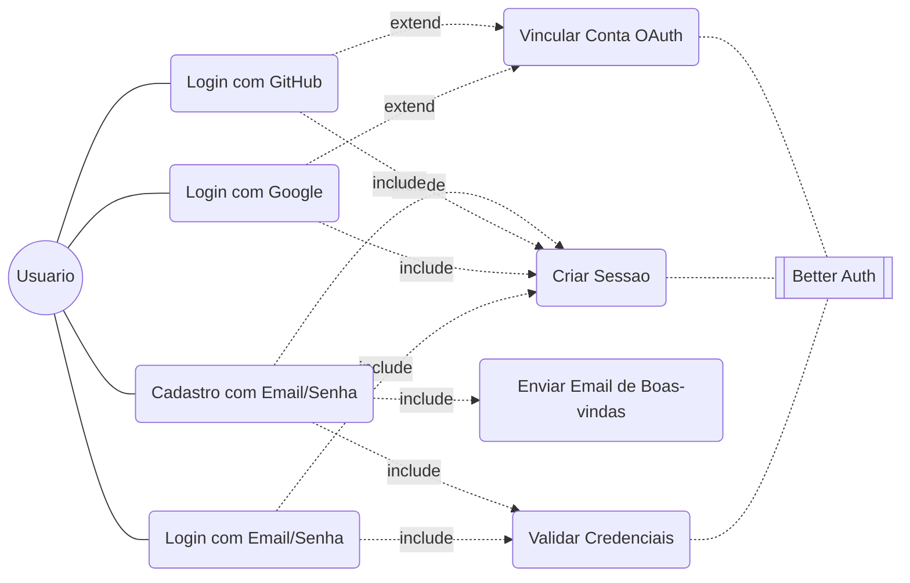
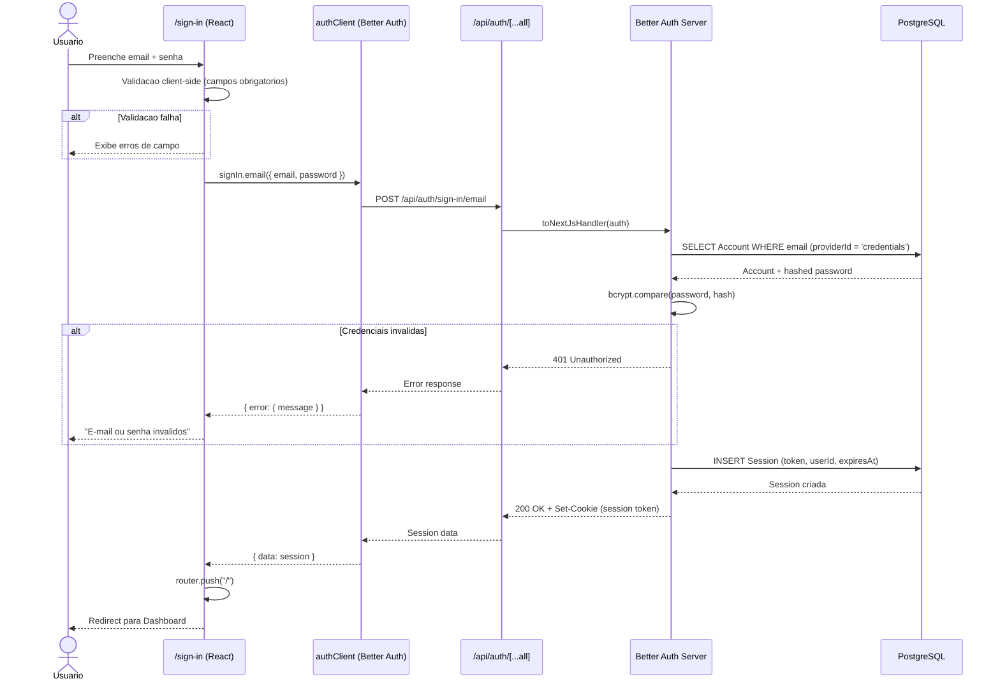
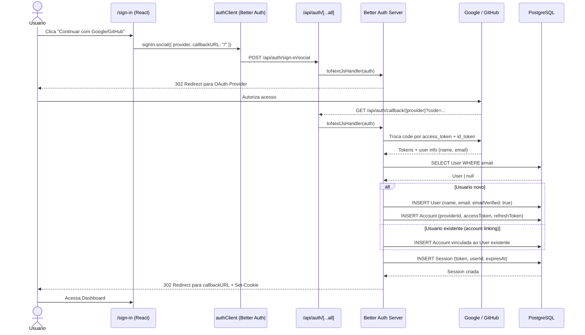
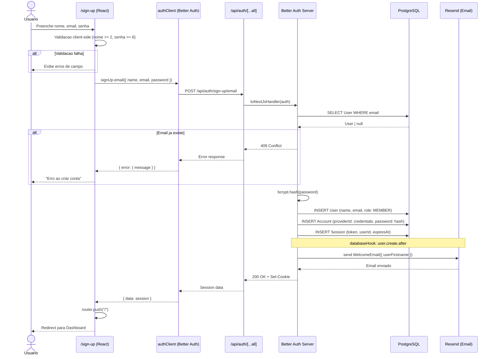
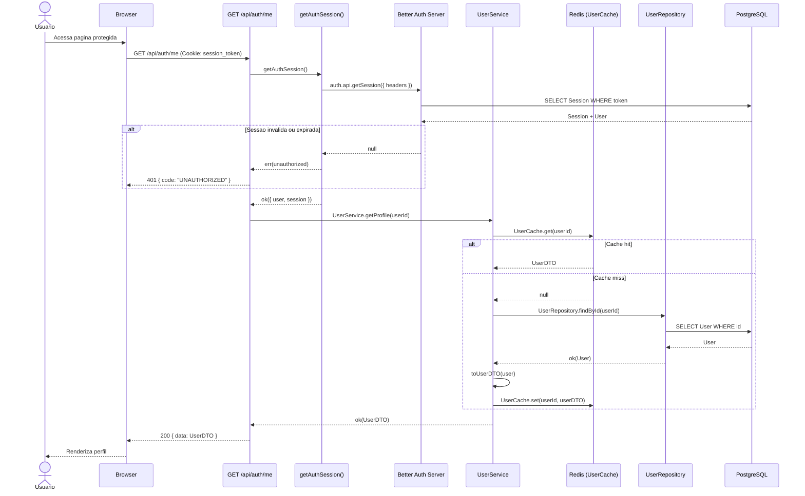

# Backend Architecture

## 1. Login

### 1.1 Caso de Uso — Autenticacao

**Atores:** Usuario
**Providers:** Email/Senha, Google OAuth, GitHub OAuth
**Lib:** Better Auth v1 com Prisma Adapter (PostgreSQL)

---

### 1.2 Diagrama de Sequencia — Login com Email/Senha

---

### 1.3 Diagrama de Sequencia — Login com OAuth (Google/GitHub)

---

### 1.4 Diagrama de Sequencia — Cadastro com Email/Senha

---

### 1.5 Diagrama de Sequencia — Request Autenticado (GET /api/auth/me)

---

### 1.6 Resumo da Arquitetura de Auth

| Camada | Arquivo | Responsabilidade |
|--------|---------|------------------|
| Config | `src/lib/auth.ts` | Better Auth com Prisma adapter, providers, hooks |
| Client | `src/lib/auth-client.ts` | `createAuthClient()` para chamadas client-side |
| Sessao | `src/lib/auth-session.ts` | `getAuthSession()` retorna `Result<Session>` |
| Route | `app/api/auth/[...all]/route.ts` | Catch-all para endpoints do Better Auth |
| Route | `app/api/auth/me/route.ts` | Perfil do usuario autenticado |
| Service | `src/services/user.service.ts` | Logica de negocio (getProfile, updateProfile) |
| Repo | `src/repositories/user.repository.ts` | Acesso ao banco (findById, findByEmail, create) |
| Cache | `src/cache/user.cache.ts` | Redis cache-aside (TTL 15 min) |
| Mapper | `src/mappers/user.mapper.ts` | `toUserDTO()` converte Prisma -> DTO |
| Schema | `src/schemas/user.schema.ts` | Zod validation (UpdateUserSchema) |
| Pages | `app/sign-in/page.tsx`, `app/sign-up/page.tsx` | UI de login/cadastro |
