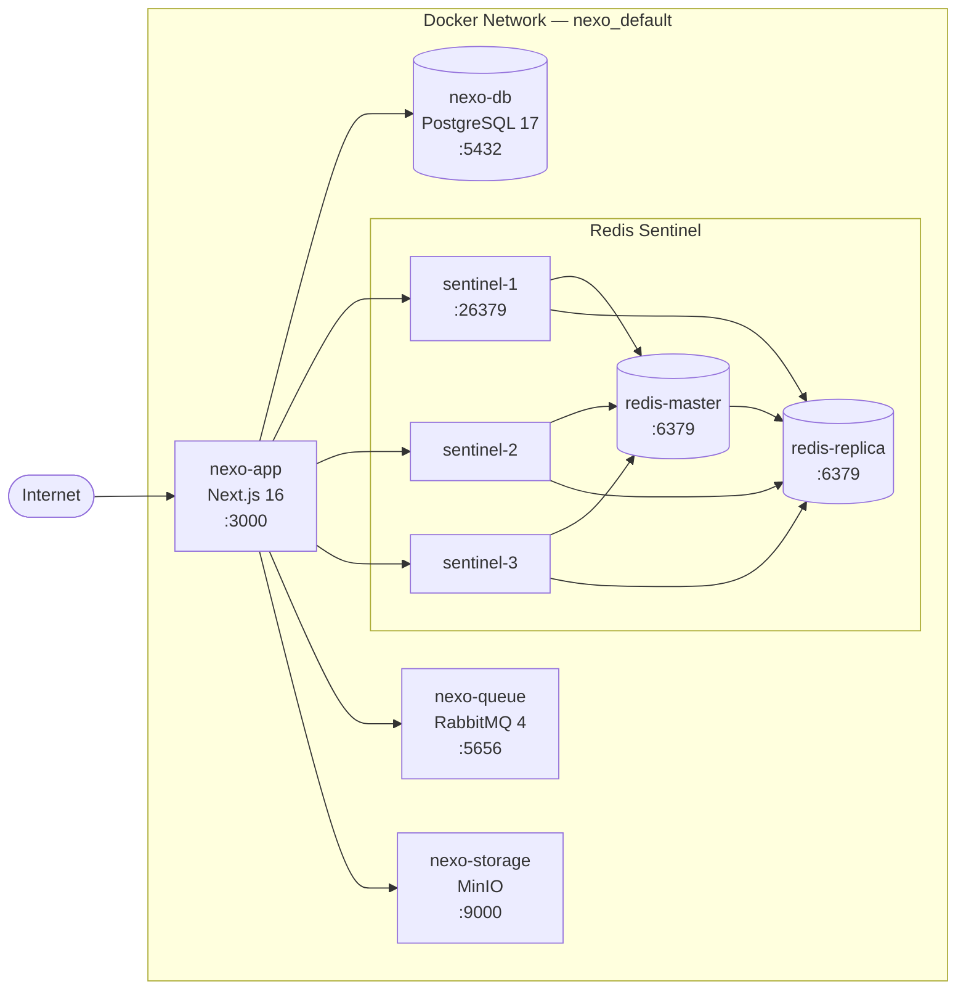
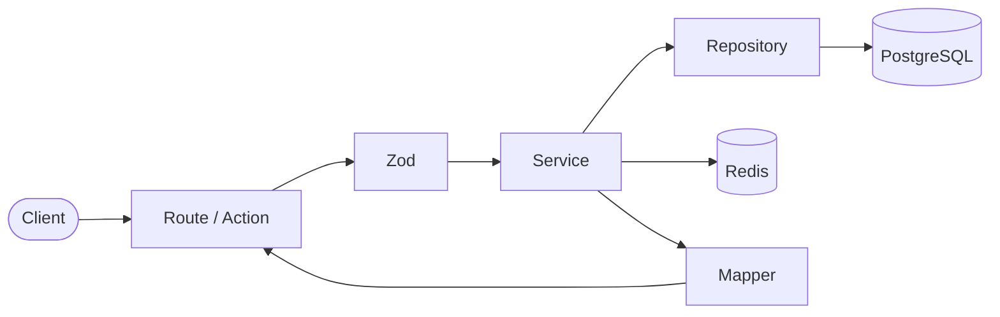
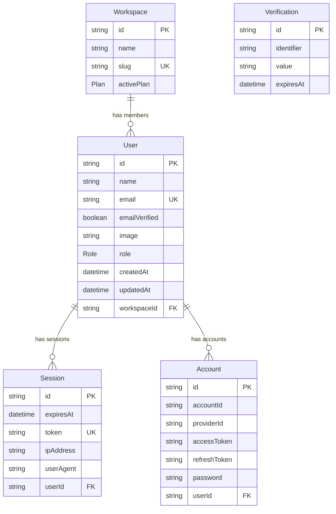
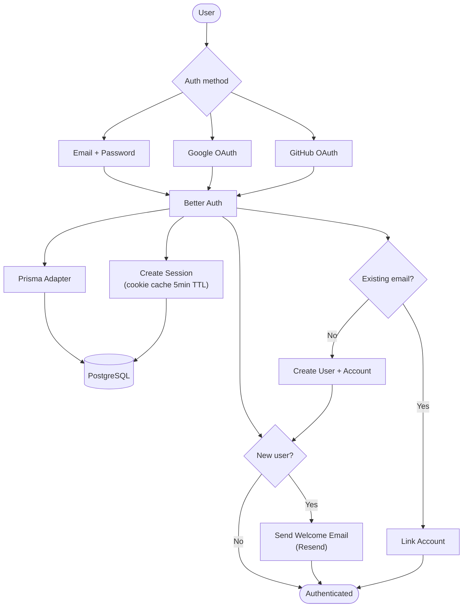
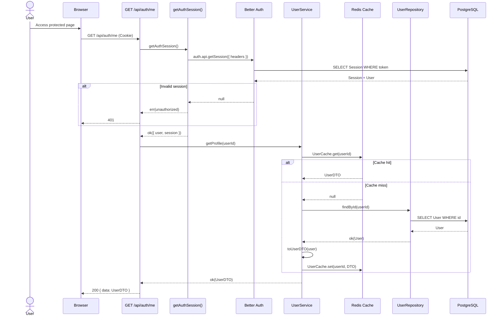

# Architecture Map

## Infrastructure

```mermaid
flowchart LR
    Internet([Internet])

    subgraph "Docker Network — nexo_default"
        App["nexo-app\nNext.js 16\n:3000"]
        DB[("nexo-db\nPostgreSQL 17\n:5432")]

        subgraph "Redis Sentinel"
            Master[("redis-master\n:6379")]
            Replica[("redis-replica\n:6379")]
            S1["sentinel-1\n:26379"]
            S2["sentinel-2"]
            S3["sentinel-3"]
        end

        Queue["nexo-queue\nRabbitMQ 4\n:5656"]
        Storage["nexo-storage\nMinIO\n:9000"]
    end

    Internet --> App
    App --> DB
    App --> S1 & S2 & S3
    S1 & S2 & S3 --> Master
    S1 & S2 & S3 --> Replica
    Master --> Replica
    App --> Queue
    App --> Storage
```

## Application Layer

```mermaid
flowchart LR
    Client([Client])
    Route["Route / Action"]
    Zod["Zod"]
    Service["Service"]
    Mapper["Mapper"]
    Repo["Repository"]
    Cache[("Redis")]
    DB[("PostgreSQL")]

    Client --> Route
    Route --> Zod
    Zod --> Service
    Service --> Repo
    Service --> Cache
    Repo --> DB
    Service --> Mapper
    Mapper --> Route
```

## Data Model

```mermaid
erDiagram
    User {
        string id PK
        string name
        string email UK
        boolean emailVerified
        string image
        Role role
        datetime createdAt
        datetime updatedAt
        string workspaceId FK
    }

    Workspace {
        string id PK
        string name
        string slug UK
        Plan activePlan
    }

    Session {
        string id PK
        datetime expiresAt
        string token UK
        string ipAddress
        string userAgent
        string userId FK
    }

    Account {
        string id PK
        string accountId
        string providerId
        string accessToken
        string refreshToken
        string password
        string userId FK
    }

    Verification {
        string id PK
        string identifier
        string value
        datetime expiresAt
    }

    Workspace ||--o{ User : "has members"
    User ||--o{ Session : "has sessions"
    User ||--o{ Account : "has accounts"
```

## Auth Flow

```mermaid
flowchart TD
    Start([User]) --> Choice{Auth method}

    Choice --> Email["Email + Password"]
    Choice --> Google["Google OAuth"]
    Choice --> GitHub["GitHub OAuth"]

    Email --> BetterAuth["Better Auth"]
    Google --> BetterAuth
    GitHub --> BetterAuth

    BetterAuth --> Prisma["Prisma Adapter"]
    Prisma --> DB[("PostgreSQL")]

    BetterAuth --> SessionCreate["Create Session\n(cookie cache 5min TTL)"]
    SessionCreate --> DB

    BetterAuth --> NewUser{New user?}
    NewUser -->|Yes| Welcome["Send Welcome Email\n(Resend)"]
    NewUser -->|No| Done([Authenticated])
    Welcome --> Done

    BetterAuth --> Linking{Existing email?}
    Linking -->|Yes| Link["Link Account"]
    Link --> Done
    Linking -->|No| Create["Create User + Account"]
    Create --> NewUser
```

## Authenticated Request

```mermaid
sequenceDiagram
    actor U as User
    participant Browser
    participant Route as GET /api/auth/me
    participant AuthN as getAuthSession()
    participant BA as Better Auth
    participant Svc as UserService
    participant Cache as Redis Cache
    participant Repo as UserRepository
    participant DB as PostgreSQL

    U ->> Browser: Access protected page
    Browser ->> Route: GET /api/auth/me (Cookie)
    Route ->> AuthN: getAuthSession()
    AuthN ->> BA: auth.api.getSession({ headers })
    BA ->> DB: SELECT Session WHERE token
    DB -->> BA: Session + User

    alt Invalid session
        BA -->> AuthN: null
        AuthN -->> Route: err(unauthorized)
        Route -->> Browser: 401
    end

    AuthN -->> Route: ok({ user, session })
    Route ->> Svc: getProfile(userId)

    Svc ->> Cache: UserCache.get(userId)

    alt Cache hit
        Cache -->> Svc: UserDTO
    else Cache miss
        Cache -->> Svc: null
        Svc ->> Repo: findById(userId)
        Repo ->> DB: SELECT User WHERE id
        DB -->> Repo: User
        Repo -->> Svc: ok(User)
        Svc ->> Svc: toUserDTO(user)
        Svc ->> Cache: UserCache.set(userId, DTO)
    end

    Svc -->> Route: ok(UserDTO)
    Route -->> Browser: 200 { data: UserDTO }
```
