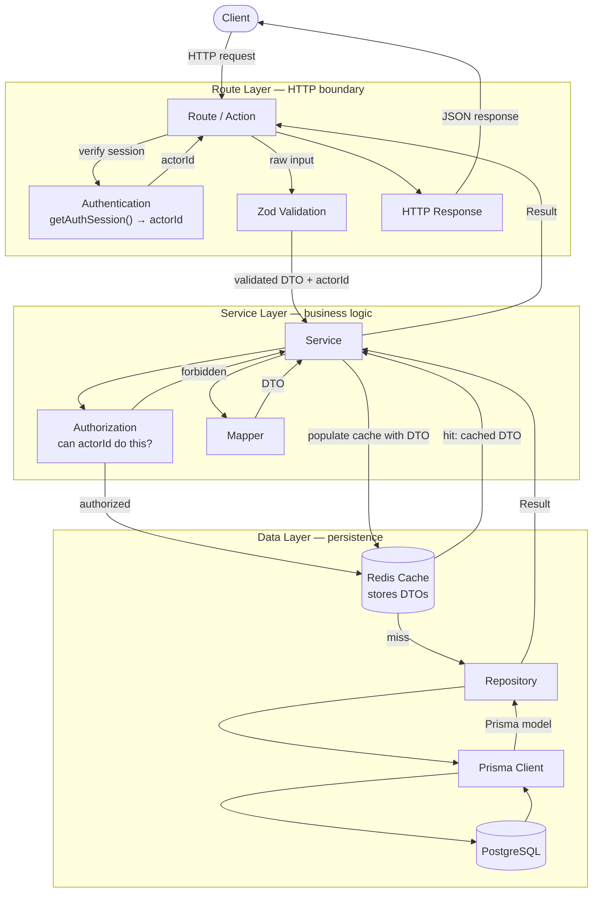
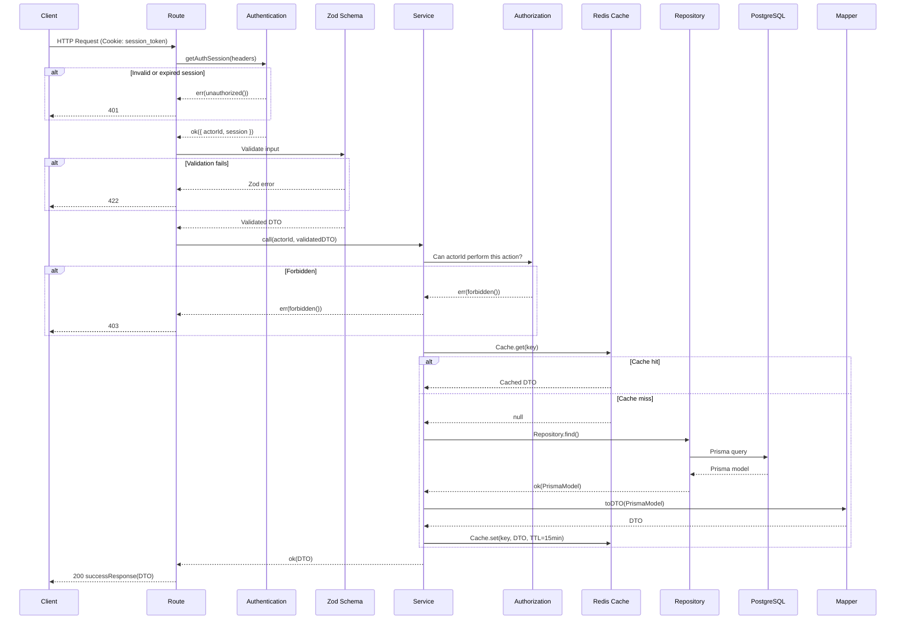
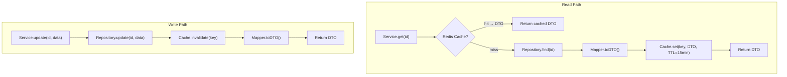

# Service Layer

## Flow

```
Client → Route/Action → Zod → Authorization → Service → Repository → Prisma/PostgreSQL
```



## Request Lifecycle



## Layer Responsibilities

| Layer | Does | Does Not |
|-------|------|----------|
| **Route** | Authenticate, validate input (Zod), call Service, convert Result to HTTP | Business logic, import Prisma |
| **Service** | Authorize, business rules, orchestrate Cache + Repo + Mapper | HTTP knowledge, import Prisma |
| **Repository** | Prisma queries, catch errors, return Result | Business logic, validation |
| **Cache** | Store/retrieve DTOs from Redis | Transform data |
| **Mapper** | Convert Prisma model → DTO | Side effects |

## Authentication vs Authorization

| Concern | Where | What | Failure |
|---------|-------|------|---------|
| **Authentication** | Route — `getAuthSession()` | Who are you? Validate session cookie | `err(unauthorized())` — 401 |
| **Authorization** | Service — permission check | Can you do this? Check role/ownership | `err(forbidden())` — 403 |

## Cache-Aside Pattern

The cache stores **DTOs** (not Prisma models). Cache reads skip the Mapper. DTO shape changes require cache invalidation on deploy.



**Rules:**
- Cache stores serialized DTOs (`JSON.stringify`)
- TTL: 15 minutes (matches access token lifetime)
- DTO shape change = invalidate all related cache keys on deploy
- Write operations always invalidate before returning

## Mapper Placement

Mappers live in the **Service layer** (`src/mappers/`), not in the Repository:

- Repository returns `Result<PrismaModel>` — raw database types
- Service calls Mapper — converts to DTO before returning or caching
- Why not in Repository? Service sometimes needs raw fields for business logic before mapping

## Error Handling

Errors are never thrown. Every operation returns `Result<T, AppError>`.

```typescript
// Repository — catches Prisma errors
async findById(id: string): Promise<Result<User>> {
  try {
    const user = await prisma.user.findUnique({ where: { id } })
    if (!user) return err(notFound('User'))
    return ok(user)
  } catch {
    return err(databaseError('Failed to find user'))
  }
}

// Service — orchestrates, returns Result
async getProfile(userId: string): Promise<Result<UserDTO>> {
  const cached = await UserCache.get(userId)
  if (cached) return ok(cached)

  const result = await UserRepository.findById(userId)
  if (!result.ok) return result

  const dto = toUserDTO(result.value)
  await UserCache.set(userId, dto)
  return ok(dto)
}

// Route — translates Result to HTTP
const result = await UserService.getProfile(userId)
if (!result.ok) return handleError(result.error)
return successResponse(result.value)
```

### Error Factories

| Factory | ErrorCode | HTTP | Usage |
|---------|-----------|------|-------|
| `unauthorized()` | `UNAUTHORIZED` | 401 | Missing/expired session |
| `invalidCredentials()` | `INVALID_CREDENTIALS` | 401 | Wrong email/password |
| `forbidden()` | `FORBIDDEN` | 403 | No permission |
| `notFound(resource)` | `RESOURCE_NOT_FOUND` | 404 | Resource not found |
| `conflict(msg)` | `CONFLICT` | 409 | Duplicate (email exists) |
| `validationError()` | `VALIDATION_ERROR` | 422 | Format validation |
| `badRequest(msg)` | `BAD_REQUEST` | 400 | Malformed request |
| `databaseError()` | `DATABASE_ERROR` | 500 | Prisma/PostgreSQL failure |

### HTTP Response Helpers

| Function | Usage |
|----------|-------|
| `successResponse(data, status?)` | Wraps data in `NextResponse<SuccessResponse<T>>` |
| `handleError(error)` | Converts `AppError` → HTTP response (for Result errors) |
| `standardError(code, msg?)` | Creates HTTP response from `ErrorCode` (for Route-level errors) |
