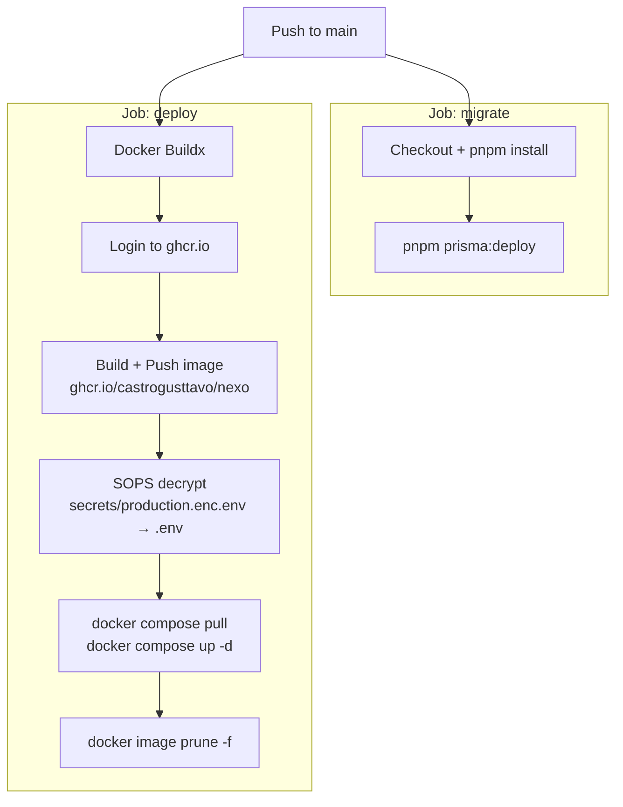

# Deployment

## Overview

Deployment is fully automated via GitHub Actions. A push to `main` triggers the CD pipeline, which runs on a self-hosted runner (the production server itself).

## Pipeline



## CD Workflow — `.github/workflows/cd.yml`

### Job: `migrate`

Runs database migrations before the new image is deployed.

1. Checkout repository
2. Setup pnpm + Node.js 20
3. `pnpm install --frozen-lockfile`
4. `pnpm prisma:deploy` — applies pending migrations

Uses `DATABASE_URL_MIGRATE` secret (may differ from app connection string for migration permissions).

### Job: `deploy`

Builds the Docker image, pushes to registry, decrypts secrets, and deploys.

1. **Docker Buildx** — enables build caching via registry
2. **Login** to `ghcr.io` with `GITHUB_TOKEN`
3. **Build + Push** — tags with git SHA + `latest`, uses registry cache
4. **Decrypt secrets** — `sops --decrypt secrets/production.enc.env > /var/www/nexo/.env`
5. **Deploy** — copies `docker-compose.yml`, pulls new image, recreates containers
6. **Prune** — removes dangling images

### Image Tags

| Tag | Purpose |
|-----|---------|
| `latest` | Always points to most recent build |
| `<git-sha>` | Immutable reference for rollback |

### Build Args & Secrets

| Name | Type | Purpose |
|------|------|---------|
| `NEXT_PUBLIC_APP_URL` | Build arg | Public URL baked into client bundle |
| `hugeicons_token` | Docker secret | NPM token for HugeIcons Pro registry |

## Rollback

To roll back to a previous version:

```bash
# On the server
cd /var/www/nexo

# Find the SHA of the version to roll back to
docker images ghcr.io/castrogusttavo/nexo --format "{{.Tag}}"

# Update compose to use specific SHA
# Edit docker-compose.yml: image: ghcr.io/castrogusttavo/nexo:<sha>
docker compose up -d
```

## Infrastructure Services

Infrastructure containers (`docker-compose.infra.yml`) are managed separately and not redeployed by the CD pipeline. They are started once and persist across application deployments.

```bash
# On the server — one-time setup or after infra changes
cd /var/www/nexo
docker compose -f docker-compose.infra.yml up -d
```
