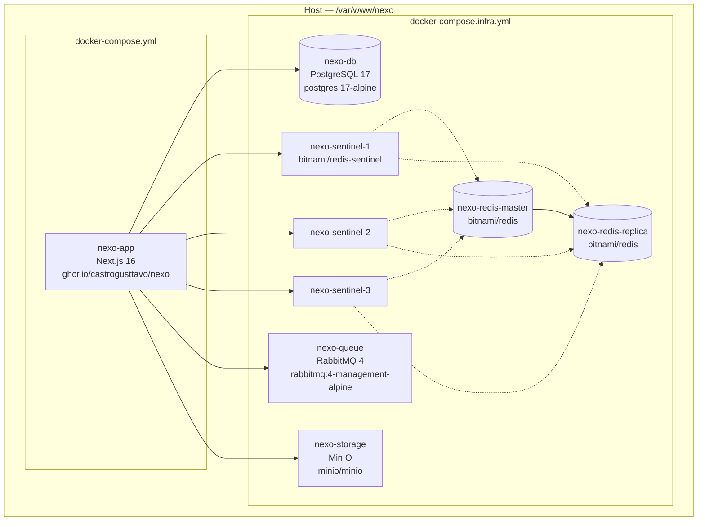
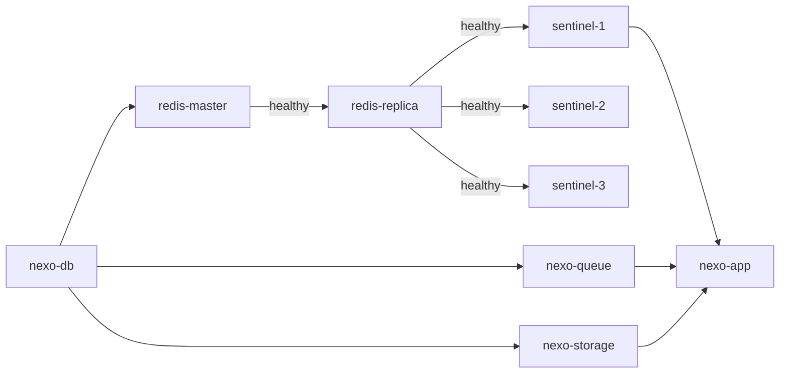

# Infrastructure Architecture

## Overview

All services run as Docker containers on a single host, connected via the `nexo_default` bridge network. Two Compose files split concerns:

| File | Purpose | Where |
|------|---------|-------|
| `docker-compose.infra.yml` | Stateful services (DB, Redis, RabbitMQ, MinIO) | Server — managed manually |
| `docker-compose.yml` | Application (Next.js) | Server — deployed by CD pipeline |



## Containers

| Container | Image | Port | Volume | Healthcheck |
|-----------|-------|------|--------|-------------|
| `nexo-db` | `postgres:17-alpine` | 5432 | `pgdata` | `pg_isready` |
| `nexo-redis-master` | `bitnami/redis:latest` | 6379 | `redis-master-data` | `redis-cli ping` |
| `nexo-redis-replica` | `bitnami/redis:latest` | — | `redis-replica-data` | `redis-cli ping` |
| `nexo-sentinel-1` | `bitnami/redis-sentinel:latest` | 26379 | — | — |
| `nexo-sentinel-2` | `bitnami/redis-sentinel:latest` | — | — | — |
| `nexo-sentinel-3` | `bitnami/redis-sentinel:latest` | — | — | — |
| `nexo-queue` | `rabbitmq:4-management-alpine` | 5656 (AMQP), 15672 (UI) | `rabbitmqdata` | `rabbitmqctl status` |
| `nexo-storage` | `minio/minio` | 9000 (API), 9001 (Console) | `miniodata` | `mc ready local` |
| `nexo-app` | `ghcr.io/castrogusttavo/nexo:latest` | 3000 | — | — |

## Volumes

All volumes are Docker named volumes, stored at `/var/lib/docker/volumes/` on the host.

| Volume | Service | Data |
|--------|---------|------|
| `pgdata` | PostgreSQL | Database files |
| `redis-master-data` | Redis master | RDB/AOF persistence |
| `redis-replica-data` | Redis replica | Replicated data |
| `rabbitmqdata` | RabbitMQ | Queue state |
| `miniodata` | MinIO | Uploaded files |

## Startup Order



Sentinel containers wait for both master and replica to be healthy via `depends_on.condition: service_healthy`.

## Docker Image Build

The application image uses a multi-stage Dockerfile:

```
Stage 1 — deps:    Install pnpm dependencies (cached layer)
Stage 2 — builder: Copy source, generate Prisma client, build Next.js
Stage 3 — runner:  Copy standalone output, run as non-root user (nextjs:nodejs)
```

Final image contains only the standalone Next.js output (~150MB vs ~1GB full build).
