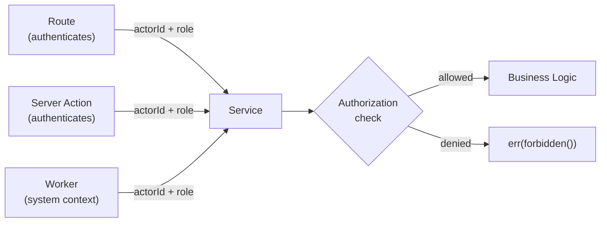

# RBAC (Role-Based Access Control)

## Roles

Defined in Prisma schema as an enum:

```prisma
enum Role {
  OWNER
  ADMIN
  MEMBER
  VIEWER
}
```

| Role | Description |
|------|-------------|
| **OWNER** | Workspace creator. Full access. Cannot be removed. |
| **ADMIN** | Full management access. Can invite/remove members, change settings. |
| **MEMBER** | Standard access. Can create/edit issues, participate in cycles. |
| **VIEWER** | Read-only access. Can view issues, pages, and analytics. |

Default role on signup: `MEMBER`.

## Enforcement

Authorization checks live inside the **Service layer**, not in Routes. This ensures every entry point (API route, server action, worker) goes through the same permission gate.



### Pattern

```typescript
// Inside a Service method
async updateProject(actorId: string, projectId: string, dto: UpdateProjectDTO) {
  // 1. Get actor's role in the workspace
  const membership = await MemberRepository.findByUserId(actorId)
  if (!membership.ok) return membership

  // 2. Check permission
  if (membership.value.role === 'VIEWER') {
    return err(forbidden('Viewers cannot update projects'))
  }

  // 3. Proceed with business logic
  ...
}
```

### Why in Service?

| Alternative | Problem |
|-------------|---------|
| Route-level middleware | Workers and server actions would bypass it |
| Decorator/annotation | TypeScript doesn't support runtime decorators well |
| Separate authorization service | Over-engineering for current scale |

Keeping authorization in the Service method is explicit, testable, and guarantees coverage across all entry points.

## Permission Matrix (Planned)

| Action | Owner | Admin | Member | Viewer |
|--------|-------|-------|--------|--------|
| Create workspace | x | — | — | — |
| Manage members | x | x | — | — |
| Update workspace settings | x | x | — | — |
| Create/edit issues | x | x | x | — |
| Create/manage cycles | x | x | x | — |
| View issues/analytics | x | x | x | x |
| Delete workspace | x | — | — | — |
