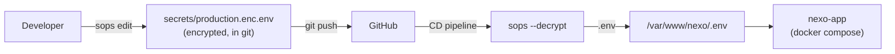

# Secrets Management

## Overview

Production secrets are encrypted with **SOPS + age** and committed to git. They are decrypted at deploy time by the CD pipeline.



## How It Works

### Encryption

Secrets are encrypted using an **age** public key defined in `.sops.yaml`:

```yaml
creation_rules:
  - path_regex: secrets/.*\.env$
    age: age1x3kamr2s7um3ga5xgg2jtakxh7r9cpnsrha2tmzrffjppx9jyf6qvqs2mm
```

The encrypted file (`secrets/production.enc.env`) is committed to git. Each value is individually encrypted — keys remain visible, values are `ENC[AES256_GCM,...]`.

### Decryption

The CD pipeline decrypts using the age private key stored as `SOPS_AGE_KEY` in GitHub Actions secrets:

```yaml
- name: Decrypt production secrets
  run: sops --decrypt secrets/production.enc.env > /var/www/nexo/.env
  env:
    SOPS_AGE_KEY: ${{ secrets.SOPS_AGE_KEY }}
```

## Editing Secrets

```bash
# Open encrypted file in $EDITOR — decrypts on open, re-encrypts on save
SOPS_AGE_KEY_FILE=~/.age/nexo-secrets.key sops secrets/production.enc.env

# Commit and push
git add secrets/production.enc.env
git commit -m "chore: update production secrets"
git push
```

If the `.env` on the server is modified directly, re-encrypt it:

```bash
# On the server
grep -v '^#' /var/www/nexo/.env | grep -v '^$' > ~/temp-clean.env

SOPS_AGE_KEY_FILE=~/.age/nexo-secrets.key sops --encrypt \
  --input-type dotenv --output-type dotenv \
  --age age1x3kamr2s7um3ga5xgg2jtakxh7r9cpnsrha2tmzrffjppx9jyf6qvqs2mm \
  ~/temp-clean.env > ~/secrets/production.enc.env

rm ~/temp-clean.env
```

Then copy `production.enc.env` to the repository and commit.

**Note:** SOPS dotenv parser does not support comments (`#`) or blank lines. Always strip them before encrypting.

## Files

| File | Committed | Purpose |
|------|-----------|---------|
| `.sops.yaml` | Yes | Maps file patterns to age public key |
| `secrets/production.enc.env` | Yes | Encrypted production secrets |
| `secrets/*.env` | No (.gitignore) | Decrypted secrets (never committed) |
| `secrets/` | No (.dockerignore) | Excluded from Docker build context |

## Key Management

| Key | Location | Access |
|-----|----------|--------|
| **Public key** | `.sops.yaml` (in repo) | Anyone can encrypt |
| **Private key** | GitHub Actions secret `SOPS_AGE_KEY` | Only CD pipeline and authorized developers |
| **Developer copy** | `~/.age/nexo-secrets.key` | Individual developer machines |

### Key Rotation

To rotate the age key:

1. Generate new key pair: `age-keygen -o new-key.key`
2. Update `.sops.yaml` with new public key
3. Re-encrypt all secrets: `sops updatekeys secrets/production.enc.env`
4. Update `SOPS_AGE_KEY` in GitHub Secrets
5. Distribute new private key to authorized developers

## Environment Variables

| Variable | Example | Description |
|----------|---------|-------------|
| `DATABASE_URL` | `postgresql://...` | PostgreSQL connection |
| `REDIS_PASSWORD` | `...` | Redis authentication |
| `REDIS_SENTINEL_PASSWORD` | `...` | Sentinel authentication |
| `REDIS_SENTINEL_HOSTS` | `nexo-sentinel-1:26379,...` | Sentinel discovery |
| `REDIS_SENTINEL_NAME` | `mymaster` | Sentinel master name |
| `BETTER_AUTH_SECRET` | `...` | Session signing key |
| `BETTER_AUTH_URL` | `https://nexo.coodee.dev` | Auth base URL |
| `GOOGLE_CLIENT_ID` | `...` | Google OAuth |
| `GOOGLE_CLIENT_SECRET` | `...` | Google OAuth |
| `GITHUB_CLIENT_ID` | `...` | GitHub OAuth |
| `GITHUB_CLIENT_SECRET` | `...` | GitHub OAuth |
| `RESEND_API_KEY` | `re_...` | Email service |
| `AXIOM_TOKEN` | `xaat-...` | Observability |
| `AXIOM_DATASET` | `nexo-app` | Axiom dataset |
| `MINIO_USER` | `...` | MinIO root user |
| `MINIO_PASSWORD` | `...` | MinIO root password |
| `RABBITMQ_USER` | `...` | RabbitMQ user |
| `RABBITMQ_PASSWORD` | `...` | RabbitMQ password |
