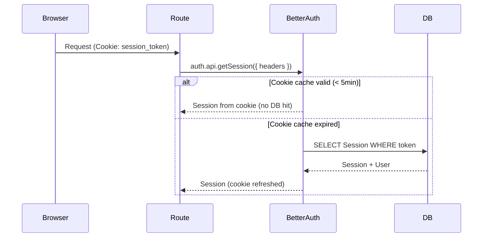

# Security Model

## Authentication

Authentication is handled by **Better Auth** with Prisma adapter (PostgreSQL).

### Providers

| Provider | Method |
|----------|--------|
| Email + Password | `signIn.email()` / `signUp.email()` |
| Google OAuth | `signIn.social({ provider: 'google' })` |
| GitHub OAuth | `signIn.social({ provider: 'github' })` |

### Account Linking

When a user signs in with an OAuth provider and the email already exists, Better Auth automatically links the new account to the existing user. This means a user who signed up with email/password can later sign in with Google (if the email matches) without creating a duplicate account.

### Session Management

- **Session store:** PostgreSQL (`sessions` table)
- **Transport:** HTTP-only cookie (`session_token`)
- **Cookie cache:** 5 minutes (Better Auth reads from cookie instead of hitting DB on every request)
- **Session lifetime:** Managed by Better Auth (configurable `expiresAt`)



### Authentication in Code

Authentication happens at the **Route layer** via `getAuthSession()`:

```typescript
// src/lib/auth-session.ts
export async function getAuthSession() {
  const session = await auth.api.getSession({ headers: await headers() })
  if (!session) return err(unauthorized('Not authenticated'))
  return ok(session)
}
```

Every protected route calls this before invoking the Service:

```typescript
// Route
const session = await getAuthSession()
if (!session.ok) return handleError(session.error)  // 401

const result = await Service.action(session.value.user.id, dto)
```

### Password Handling

- Passwords are hashed with bcrypt by Better Auth before storage
- The application never sees or handles raw passwords — Better Auth manages the full flow
- Password hashes are stored in the `accounts` table (`providerId: 'credentials'`)

### Welcome Email

On user creation, a `databaseHook` triggers a welcome email via Resend. This is fire-and-forget — email failures are logged but don't block signup.

## Key Files

| File | Purpose |
|------|---------|
| `src/lib/auth.ts` | Better Auth server configuration |
| `src/lib/auth-client.ts` | Better Auth client for browser |
| `src/lib/auth-session.ts` | `getAuthSession()` — server-side session validation |
| `app/api/auth/[...all]/route.ts` | Catch-all route for Better Auth endpoints |
