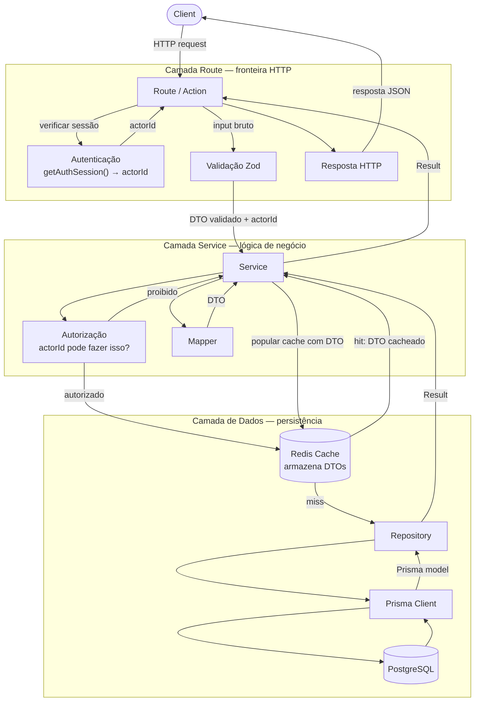
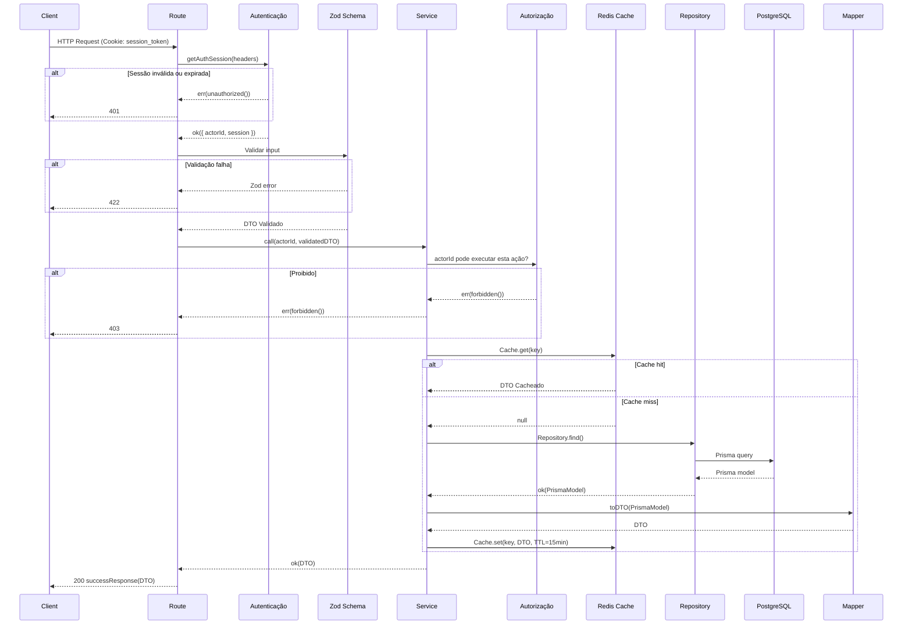
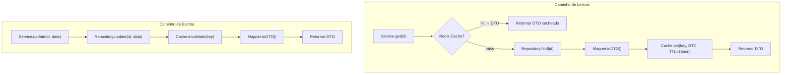

# Service Layer

## Fluxo

```
Client → Route/Action → Zod → Autorização → Service → Repository → Prisma/PostgreSQL
```



## Ciclo de Vida da Request



## Responsabilidades por Camada

| Camada | Faz | Não Faz |
|--------|-----|---------|
| **Route** | Autenticar, validar input (Zod), chamar Service, converter Result em HTTP | Lógica de negócio, importar Prisma |
| **Service** | Autorizar, regras de negócio, orquestrar Cache + Repo + Mapper | Conhecimento HTTP, importar Prisma |
| **Repository** | Queries Prisma, capturar erros, retornar Result | Lógica de negócio, validação |
| **Cache** | Armazenar/recuperar DTOs do Redis | Transformar dados |
| **Mapper** | Converter Prisma model → DTO | Efeitos colaterais |

## Autenticação vs Autorização

| Preocupação | Onde | O quê | Falha |
|-------------|------|-------|-------|
| **Autenticação** | Route — `getAuthSession()` | Quem é você? Validar cookie de sessão | `err(unauthorized())` — 401 |
| **Autorização** | Service — checagem de permissão | Você pode fazer isso? Checar role/ownership | `err(forbidden())` — 403 |

## Padrão Cache-Aside

O cache armazena **DTOs** (não models do Prisma). Leituras do cache pulam o Mapper. Mudanças no formato do DTO requerem invalidação do cache no deploy.



**Regras:**
- Cache armazena DTOs serializados (`JSON.stringify`)
- TTL: 15 minutos (alinhado com tempo de vida do access token)
- Mudança no formato do DTO = invalidar todas as chaves de cache relacionadas no deploy
- Operações de escrita sempre invalidam antes de retornar

## Posicionamento do Mapper

Mappers vivem na **camada Service** (`src/mappers/`), não no Repository:

- Repository retorna `Result<PrismaModel>` — tipos brutos do banco
- Service chama o Mapper — converte para DTO antes de retornar ou cachear
- Por que não no Repository? O Service às vezes precisa de campos brutos para lógica de negócio antes de mapear

## Tratamento de Erros

Erros nunca são lançados. Toda operação retorna `Result<T, AppError>`.

```typescript
// Repository — captura erros do Prisma
async findById(id: string): Promise<Result<User>> {
  try {
    const user = await prisma.user.findUnique({ where: { id } })
    if (!user) return err(notFound('User'))
    return ok(user)
  } catch {
    return err(databaseError('Failed to find user'))
  }
}

// Service — orquestra, retorna Result
async getProfile(userId: string): Promise<Result<UserDTO>> {
  const cached = await UserCache.get(userId)
  if (cached) return ok(cached)

  const result = await UserRepository.findById(userId)
  if (!result.ok) return result

  const dto = toUserDTO(result.value)
  await UserCache.set(userId, dto)
  return ok(dto)
}

// Route — traduz Result para HTTP
const result = await UserService.getProfile(userId)
if (!result.ok) return handleError(result.error)
return successResponse(result.value)
```

### Error Factories

| Factory | ErrorCode | HTTP | Uso |
|---------|-----------|------|-----|
| `unauthorized()` | `UNAUTHORIZED` | 401 | Sessão ausente/expirada |
| `invalidCredentials()` | `INVALID_CREDENTIALS` | 401 | Email/senha incorretos |
| `forbidden()` | `FORBIDDEN` | 403 | Sem permissão |
| `notFound(resource)` | `RESOURCE_NOT_FOUND` | 404 | Recurso não encontrado |
| `conflict(msg)` | `CONFLICT` | 409 | Duplicata (email já existe) |
| `validationError()` | `VALIDATION_ERROR` | 422 | Validação de formato |
| `badRequest(msg)` | `BAD_REQUEST` | 400 | Request malformada |
| `databaseError()` | `DATABASE_ERROR` | 500 | Falha do Prisma/PostgreSQL |

### Helpers de Resposta HTTP

| Função | Uso |
|--------|-----|
| `successResponse(data, status?)` | Envolve dados em `NextResponse<SuccessResponse<T>>` |
| `handleError(error)` | Converte `AppError` → resposta HTTP (para erros de Result) |
| `standardError(code, msg?)` | Cria resposta HTTP a partir de `ErrorCode` (para erros na camada Route) |
