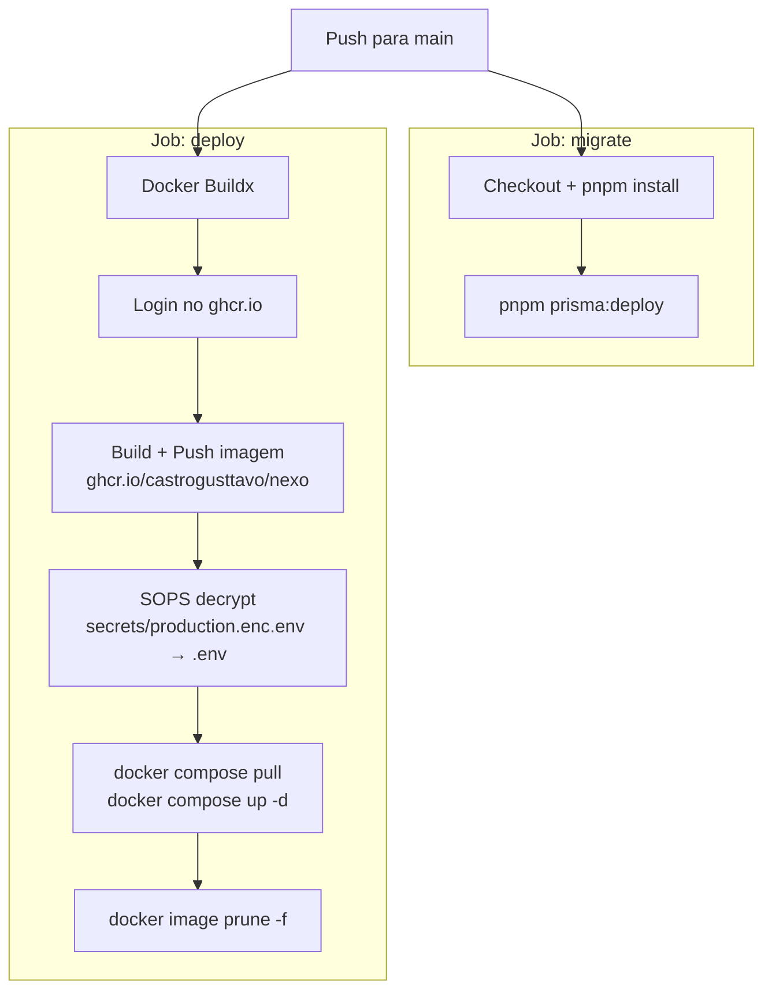

# Deploy

## Visão Geral

O deploy é totalmente automatizado via GitHub Actions. Um push para `main` aciona a pipeline de CD, que roda em um runner self-hosted (o próprio servidor de produção).

## Pipeline



## Workflow de CD — `.github/workflows/cd.yml`

### Job: `migrate`

Roda migrations do banco de dados antes do deploy da nova imagem.

1. Checkout do repositório
2. Setup pnpm + Node.js 20
3. `pnpm install --frozen-lockfile`
4. `pnpm prisma:deploy` — aplica migrations pendentes

Usa o secret `DATABASE_URL_MIGRATE` (pode diferir da connection string da app por permissões de migration).

### Job: `deploy`

Builda a imagem Docker, pusha para o registry, decripta secrets e faz deploy.

1. **Docker Buildx** — habilita cache de build via registry
2. **Login** no `ghcr.io` com `GITHUB_TOKEN`
3. **Build + Push** — tags com git SHA + `latest`, usa cache do registry
4. **Decriptar secrets** — `sops --decrypt secrets/production.enc.env > /var/www/nexo/.env`
5. **Deploy** — copia `docker-compose.yml`, puxa nova imagem, recria containers
6. **Prune** — remove imagens pendentes

### Tags da Imagem

| Tag | Propósito |
|-----|-----------|
| `latest` | Sempre aponta para o build mais recente |
| `<git-sha>` | Referência imutável para rollback |

### Build Args & Secrets

| Nome | Tipo | Propósito |
|------|------|-----------|
| `NEXT_PUBLIC_APP_URL` | Build arg | URL pública embutida no bundle do client |
| `hugeicons_token` | Docker secret | Token NPM para registry do HugeIcons Pro |

## Rollback

Para fazer rollback para uma versão anterior:

```bash
# No servidor
cd /var/www/nexo

# Encontrar o SHA da versão para rollback
docker images ghcr.io/castrogusttavo/nexo --format "{{.Tag}}"

# Atualizar compose para usar SHA específico
# Editar docker-compose.yml: image: ghcr.io/castrogusttavo/nexo:<sha>
docker compose up -d
```

## Serviços de Infraestrutura

Containers de infraestrutura (`docker-compose.infra.yml`) são gerenciados separadamente e não são re-deployados pela pipeline de CD. Eles são iniciados uma vez e persistem entre deploys da aplicação.

```bash
# No servidor — setup inicial ou após mudanças de infra
cd /var/www/nexo
docker compose -f docker-compose.infra.yml up -d
```
