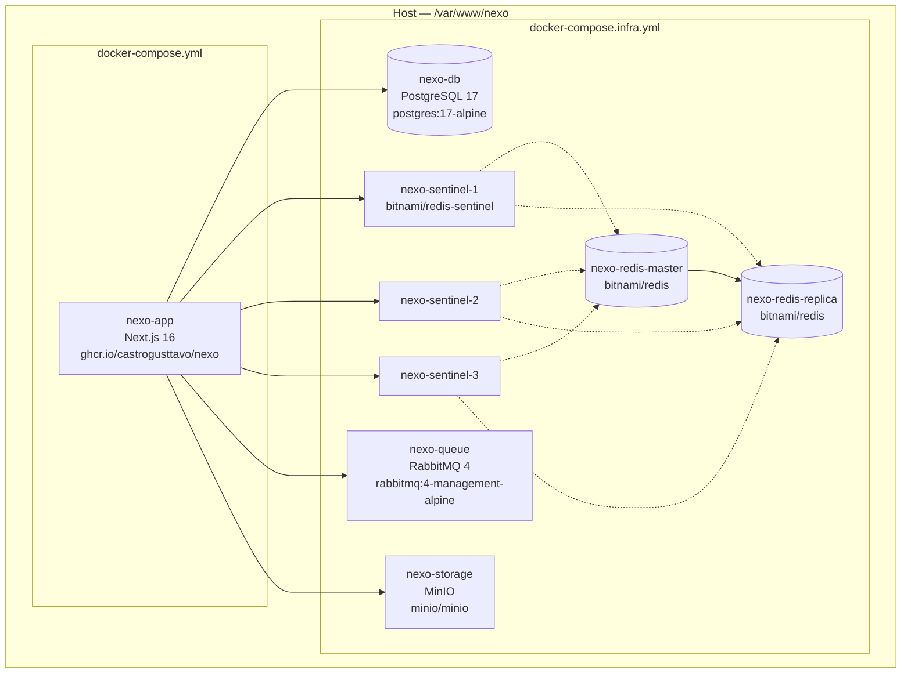
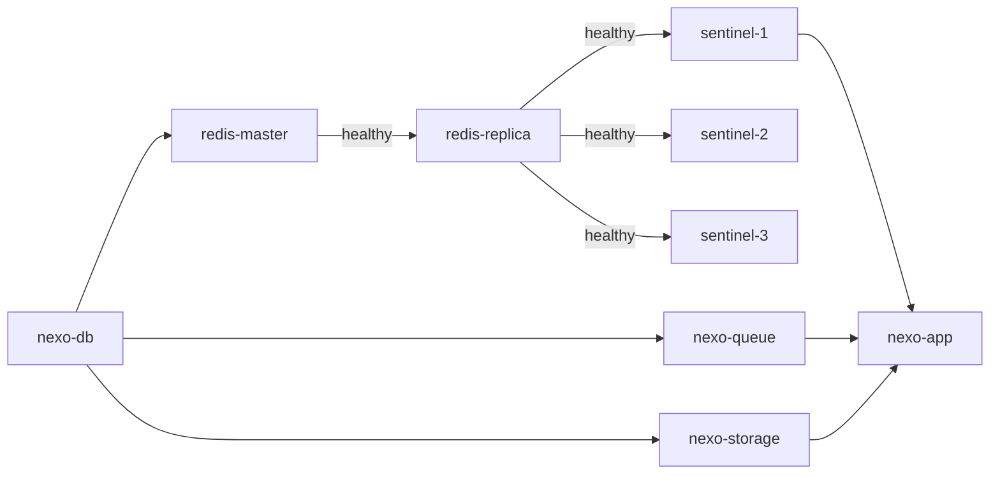

# Arquitetura de Infraestrutura

## Visão Geral

Todos os serviços rodam como containers Docker em um único host, conectados pela rede bridge `nexo_default`. Dois arquivos Compose separam as responsabilidades:

| Arquivo | Propósito | Onde |
|---------|-----------|------|
| `docker-compose.infra.yml` | Serviços stateful (DB, Redis, RabbitMQ, MinIO) | Servidor — gerenciado manualmente |
| `docker-compose.yml` | Aplicação (Next.js) | Servidor — deploy pela pipeline de CD |



## Containers

| Container | Imagem | Porta | Volume | Healthcheck |
|-----------|--------|-------|--------|-------------|
| `nexo-db` | `postgres:17-alpine` | 5432 | `pgdata` | `pg_isready` |
| `nexo-redis-master` | `bitnami/redis:latest` | 6379 | `redis-master-data` | `redis-cli ping` |
| `nexo-redis-replica` | `bitnami/redis:latest` | — | `redis-replica-data` | `redis-cli ping` |
| `nexo-sentinel-1` | `bitnami/redis-sentinel:latest` | 26379 | — | — |
| `nexo-sentinel-2` | `bitnami/redis-sentinel:latest` | — | — | — |
| `nexo-sentinel-3` | `bitnami/redis-sentinel:latest` | — | — | — |
| `nexo-queue` | `rabbitmq:4-management-alpine` | 5656 (AMQP), 15672 (UI) | `rabbitmqdata` | `rabbitmqctl status` |
| `nexo-storage` | `minio/minio` | 9000 (API), 9001 (Console) | `miniodata` | `mc ready local` |
| `nexo-app` | `ghcr.io/castrogusttavo/nexo:latest` | 3000 | — | — |

## Volumes

Todos os volumes são volumes nomeados do Docker, armazenados em `/var/lib/docker/volumes/` no host.

| Volume | Serviço | Dados |
|--------|---------|-------|
| `pgdata` | PostgreSQL | Arquivos do banco de dados |
| `redis-master-data` | Redis master | Persistência RDB/AOF |
| `redis-replica-data` | Redis réplica | Dados replicados |
| `rabbitmqdata` | RabbitMQ | Estado das filas |
| `miniodata` | MinIO | Arquivos enviados |

## Ordem de Inicialização



Containers Sentinel esperam que tanto o master quanto a réplica estejam healthy via `depends_on.condition: service_healthy`.

## Build da Imagem Docker

A imagem da aplicação usa um Dockerfile multi-stage:

```
Stage 1 — deps:    Instalar dependências pnpm (camada cacheada)
Stage 2 — builder: Copiar código-fonte, gerar Prisma client, build do Next.js
Stage 3 — runner:  Copiar output standalone, rodar como usuário não-root (nextjs:nodejs)
```

A imagem final contém apenas o output standalone do Next.js (~150MB vs ~1GB do build completo).
