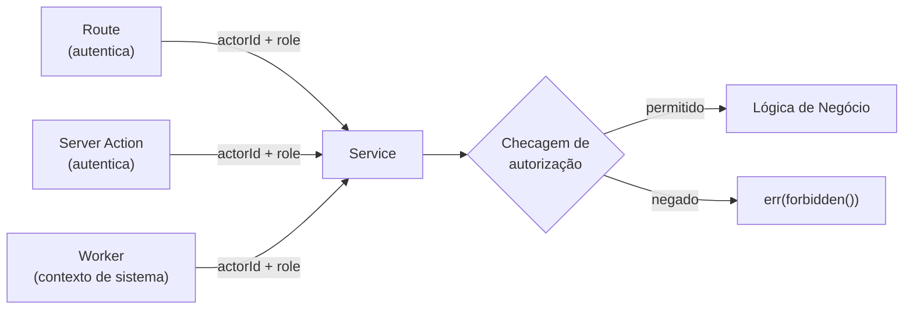

# RBAC (Controle de Acesso Baseado em Roles)

## Roles

Definidas no schema Prisma como um enum:

```prisma
enum Role {
  OWNER
  ADMIN
  MEMBER
  VIEWER
}
```

| Role | Descrição |
|------|-----------|
| **OWNER** | Criador do workspace. Acesso total. Não pode ser removido. |
| **ADMIN** | Acesso completo de gerenciamento. Pode convidar/remover membros, alterar configurações. |
| **MEMBER** | Acesso padrão. Pode criar/editar issues, participar de ciclos. |
| **VIEWER** | Acesso somente leitura. Pode visualizar issues, páginas e analytics. |

Role padrão no cadastro: `MEMBER`.

## Enforcement

Checagens de autorização vivem dentro da **camada Service**, não nas Routes. Isso garante que todo ponto de entrada (API route, server action, worker) passe pelo mesmo portão de permissão.



### Padrão

```typescript
// Dentro de um método do Service
async updateProject(actorId: string, projectId: string, dto: UpdateProjectDTO) {
  // 1. Buscar role do actor no workspace
  const membership = await MemberRepository.findByUserId(actorId)
  if (!membership.ok) return membership

  // 2. Checar permissão
  if (membership.value.role === 'VIEWER') {
    return err(forbidden('Viewers não podem atualizar projetos'))
  }

  // 3. Prosseguir com lógica de negócio
  ...
}
```

### Por que no Service?

| Alternativa | Problema |
|-------------|----------|
| Middleware na Route | Workers e server actions bypassariam |
| Decorator/annotation | TypeScript não suporta bem decorators em runtime |
| Serviço de autorização separado | Over-engineering para a escala atual |

Manter a autorização no método do Service é explícito, testável e garante cobertura em todos os pontos de entrada.

## Matriz de Permissões (Planejada)

| Ação | Owner | Admin | Member | Viewer |
|------|-------|-------|--------|--------|
| Criar workspace | x | — | — | — |
| Gerenciar membros | x | x | — | — |
| Atualizar configurações do workspace | x | x | — | — |
| Criar/editar issues | x | x | x | — |
| Criar/gerenciar ciclos | x | x | x | — |
| Visualizar issues/analytics | x | x | x | x |
| Deletar workspace | x | — | — | — |
