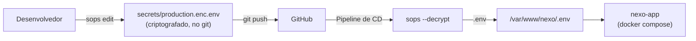

# Gerenciamento de Secrets

## Visão Geral

Secrets de produção são criptografados com **SOPS + age** e commitados no git. São decriptados no momento do deploy pela pipeline de CD.



## Como Funciona

### Criptografia

Secrets são criptografados usando uma chave pública **age** definida no `.sops.yaml`:

```yaml
creation_rules:
  - path_regex: secrets/.*\.env$
    age: age1x3kamr2s7um3ga5xgg2jtakxh7r9cpnsrha2tmzrffjppx9jyf6qvqs2mm
```

O arquivo criptografado (`secrets/production.enc.env`) é commitado no git. Cada valor é criptografado individualmente — chaves permanecem visíveis, valores são `ENC[AES256_GCM,...]`.

### Decriptação

A pipeline de CD decripta usando a chave privada age armazenada como `SOPS_AGE_KEY` nos secrets do GitHub Actions:

```yaml
- name: Decriptar secrets de produção
  run: sops --decrypt secrets/production.enc.env > /var/www/nexo/.env
  env:
    SOPS_AGE_KEY: ${{ secrets.SOPS_AGE_KEY }}
```

## Editando Secrets

```bash
# Abrir arquivo criptografado no $EDITOR — decripta ao abrir, re-criptografa ao salvar
SOPS_AGE_KEY_FILE=~/.age/nexo-secrets.key sops secrets/production.enc.env

# Commitar e pushar
git add secrets/production.enc.env
git commit -m "chore: update production secrets"
git push
```

Se o `.env` no servidor for modificado diretamente, re-criptografe:

```bash
# No servidor
grep -v '^#' /var/www/nexo/.env | grep -v '^$' > ~/temp-clean.env

SOPS_AGE_KEY_FILE=~/.age/nexo-secrets.key sops --encrypt \
  --input-type dotenv --output-type dotenv \
  --age age1x3kamr2s7um3ga5xgg2jtakxh7r9cpnsrha2tmzrffjppx9jyf6qvqs2mm \
  ~/temp-clean.env > ~/secrets/production.enc.env

rm ~/temp-clean.env
```

Depois copie `production.enc.env` para o repositório e commite.

**Nota:** O parser dotenv do SOPS não suporta comentários (`#`) ou linhas em branco. Sempre remova-os antes de criptografar.

## Arquivos

| Arquivo | Commitado | Propósito |
|---------|-----------|-----------|
| `.sops.yaml` | Sim | Mapeia padrões de arquivo para chave pública age |
| `secrets/production.enc.env` | Sim | Secrets de produção criptografados |
| `secrets/*.env` | Não (.gitignore) | Secrets decriptados (nunca commitados) |
| `secrets/` | Não (.dockerignore) | Excluído do contexto de build do Docker |

## Gerenciamento de Chaves

| Chave | Localização | Acesso |
|-------|------------|--------|
| **Chave pública** | `.sops.yaml` (no repo) | Qualquer pessoa pode criptografar |
| **Chave privada** | Secret do GitHub Actions `SOPS_AGE_KEY` | Apenas pipeline de CD e desenvolvedores autorizados |
| **Cópia do desenvolvedor** | `~/.age/nexo-secrets.key` | Máquinas individuais de desenvolvedores |

### Rotação de Chaves

Para rotacionar a chave age:

1. Gerar novo par de chaves: `age-keygen -o new-key.key`
2. Atualizar `.sops.yaml` com a nova chave pública
3. Re-criptografar todos os secrets: `sops updatekeys secrets/production.enc.env`
4. Atualizar `SOPS_AGE_KEY` nos Secrets do GitHub
5. Distribuir nova chave privada para desenvolvedores autorizados

## Variáveis de Ambiente

| Variável | Exemplo | Descrição |
|----------|---------|-----------|
| `DATABASE_URL` | `postgresql://...` | Conexão PostgreSQL |
| `REDIS_PASSWORD` | `...` | Autenticação Redis |
| `REDIS_SENTINEL_PASSWORD` | `...` | Autenticação Sentinel |
| `REDIS_SENTINEL_HOSTS` | `nexo-sentinel-1:26379,...` | Descoberta Sentinel |
| `REDIS_SENTINEL_NAME` | `mymaster` | Nome do master Sentinel |
| `BETTER_AUTH_SECRET` | `...` | Chave de assinatura de sessão |
| `BETTER_AUTH_URL` | `https://nexo.coodee.dev` | URL base de auth |
| `GOOGLE_CLIENT_ID` | `...` | Google OAuth |
| `GOOGLE_CLIENT_SECRET` | `...` | Google OAuth |
| `GITHUB_CLIENT_ID` | `...` | GitHub OAuth |
| `GITHUB_CLIENT_SECRET` | `...` | GitHub OAuth |
| `RESEND_API_KEY` | `re_...` | Serviço de e-mail |
| `AXIOM_TOKEN` | `xaat-...` | Observabilidade |
| `AXIOM_DATASET` | `nexo-app` | Dataset do Axiom |
| `MINIO_USER` | `...` | Usuário root do MinIO |
| `MINIO_PASSWORD` | `...` | Senha root do MinIO |
| `RABBITMQ_USER` | `...` | Usuário RabbitMQ |
| `RABBITMQ_PASSWORD` | `...` | Senha RabbitMQ |
