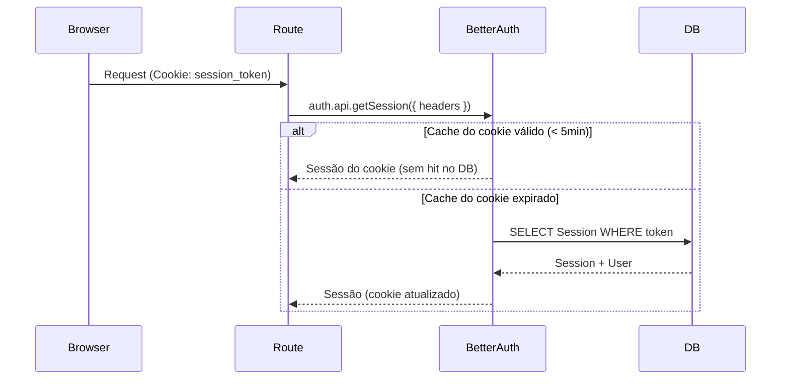

# Modelo de Segurança

## Autenticação

A autenticação é gerenciada pelo **Better Auth** com adapter Prisma (PostgreSQL).

### Provedores

| Provedor | Método |
|----------|--------|
| Email + Senha | `signIn.email()` / `signUp.email()` |
| Google OAuth | `signIn.social({ provider: 'google' })` |
| GitHub OAuth | `signIn.social({ provider: 'github' })` |

### Vinculação de Contas

Quando um usuário faz login com um provedor OAuth e o email já existe, o Better Auth automaticamente vincula a nova conta ao usuário existente. Isso significa que um usuário que se cadastrou com email/senha pode depois fazer login com Google (se o email for o mesmo) sem criar uma conta duplicada.

### Gerenciamento de Sessão

- **Armazenamento de sessão:** PostgreSQL (tabela `sessions`)
- **Transporte:** Cookie HTTP-only (`session_token`)
- **Cache de cookie:** 5 minutos (Better Auth lê do cookie ao invés de consultar o DB em cada request)
- **Tempo de vida da sessão:** Gerenciado pelo Better Auth (configurável via `expiresAt`)



### Autenticação no Código

A autenticação acontece na **camada Route** via `getAuthSession()`:

```typescript
// src/lib/auth-session.ts
export async function getAuthSession() {
  const session = await auth.api.getSession({ headers: await headers() })
  if (!session) return err(unauthorized('Not authenticated'))
  return ok(session)
}
```

Toda rota protegida chama isso antes de invocar o Service:

```typescript
// Route
const session = await getAuthSession()
if (!session.ok) return handleError(session.error)  // 401

const result = await Service.action(session.value.user.id, dto)
```

### Tratamento de Senhas

- Senhas são hasheadas com bcrypt pelo Better Auth antes do armazenamento
- A aplicação nunca vê ou manipula senhas brutas — Better Auth gerencia o fluxo completo
- Hashes de senhas são armazenados na tabela `accounts` (`providerId: 'credentials'`)

### E-mail de Boas-vindas

Na criação do usuário, um `databaseHook` dispara um e-mail de boas-vindas via Resend. Isso é fire-and-forget — falhas no e-mail são logadas mas não bloqueiam o cadastro.

## Arquivos Importantes

| Arquivo | Propósito |
|---------|-----------|
| `src/lib/auth.ts` | Configuração do Better Auth no servidor |
| `src/lib/auth-client.ts` | Client do Better Auth para o browser |
| `src/lib/auth-session.ts` | `getAuthSession()` — validação de sessão no servidor |
| `app/api/auth/[...all]/route.ts` | Rota catch-all para endpoints do Better Auth |
