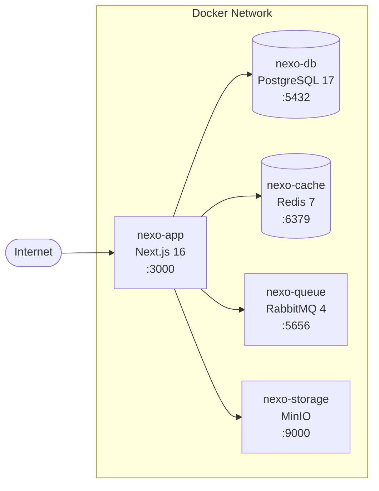
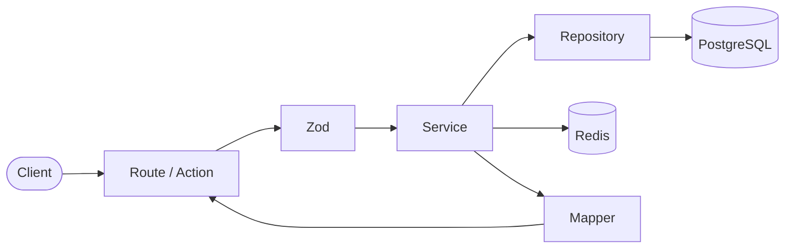
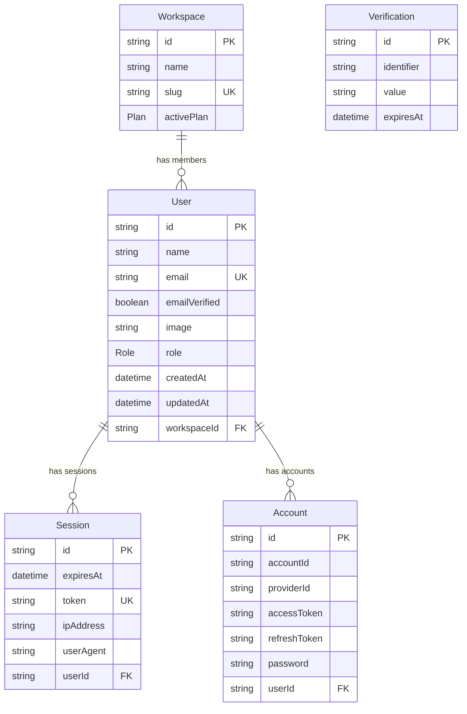
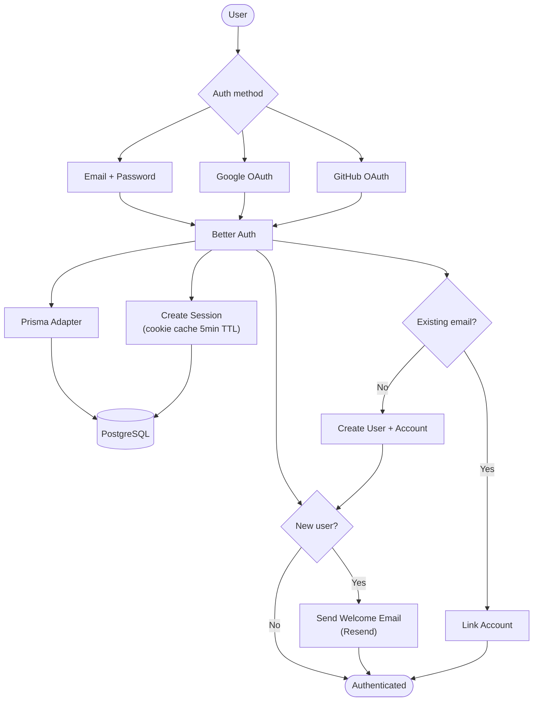

# Software Architecture

## Table of contents

- [Overview](#overview)
- [Features](#features)
- [Functional requirements](#functional-requirements)
- [Non-functional requirements](#non-functional-requirements)
- [Tech stack](#tech-stack)
- [Diagrams](#diagrams)
  - [Infrastructure](#infrastructure)
  - [Application layer](#application-layer)
  - [Data model](#data-model)
  - [Auth flow](#auth-flow)
  - [Sequence — Create issue](#sequence--create-issue)
- [Architecture](#architecture)
  - [Service layer](#service-layer)
  - [Result pattern and error handling](#result-pattern-and-error-handling)
  - [Code patterns](#code-patterns)
  - [Folder structure](#folder-structure)

---

## Overview

Nexo is a project management platform that combines the best of Plane, Jira, and Linear into a single experience. It is built for teams that need powerful issue tracking, sprint management, and product roadmaps without enterprise-tool complexity.

**Architecture principles:**

- **Layered separation** — Routes handle HTTP, Services own business logic, Repositories own data access. No layer crosses its boundary.
- **Errors as values** — `Result<T, AppError>` everywhere. No thrown exceptions, no try/catch outside repositories.
- **Authorization in the domain** — Permission checks live inside Services, not in Routes, so every entry point (API, action, worker) goes through the same gate.
- **Infrastructure as containers** — PostgreSQL, Redis, RabbitMQ, and MinIO run as Docker containers on a shared network.

---

## Features

| Feature | Description |
|---------|-------------|
| **Issues** | Rich text editor, file uploads, sub-issues, labels, assignees, priorities |
| **Cycles** | Sprint-like iterations with burn-down charts and automated progress tracking |
| **Modules** | Group related issues into focused deliverables |
| **Views** | Filtered, saved, and shareable issue displays (table, board, timeline) |
| **Pages** | Documentation and note-taking with Markdown support |
| **Analytics** | Real-time dashboards with velocity, workload, and project health metrics |
| **Workspaces** | Multi-tenant with RBAC (Owner, Admin, Member, Viewer) |
| **API** | RESTful API with Scalar-powered interactive documentation |

---

## Functional requirements

### Auth

- [x] Sign up with email and password
- [x] Sign in with email and password
- [x] Sign in with Google OAuth
- [x] Sign in with GitHub OAuth
- [x] Account linking (multiple providers per user)
- [x] Session management with cookie cache (5 min TTL)
- [x] Send welcome email on sign up
- [ ] Password reset via email
- [ ] Email verification flow

### User

- [x] Get authenticated user profile
- [x] Update user name
- [x] Update user email (with uniqueness check)
- [ ] Upload and update profile image
- [ ] Delete account

### Workspace

- [ ] Create workspace with slug
- [ ] Invite users to workspace
- [ ] Assign roles (Owner, Admin, Member, Viewer)
- [ ] Update workspace settings
- [ ] Manage workspace plans (Basic, Pro, Enterprise)

### Issues

- [ ] Create issue with title, description, priority, labels
- [ ] Assign issue to user
- [ ] Create sub-issues
- [ ] Cross-reference issues
- [ ] Change issue status
- [ ] Filter and sort issues
- [ ] File attachments via MinIO

### Cycles

- [ ] Create time-boxed cycle
- [ ] Add issues to cycle
- [ ] Burn-down chart calculation
- [ ] Auto-complete cycle

### Modules

- [ ] Create module
- [ ] Add issues to module
- [ ] Track module progress

### Views

- [ ] Create custom filtered views
- [ ] Save and share views
- [ ] Table, board, and timeline layouts

### Pages

- [ ] Create pages with rich text (Tiptap)
- [ ] Convert page content to issues
- [ ] Markdown storage and rendering

### Analytics

- [ ] Velocity metrics per cycle
- [ ] Workload distribution per user
- [ ] Project health dashboard

---

## Non-functional requirements

| Category | Requirement |
|----------|-------------|
| **Performance** | Page loads under 1s with Next.js server components and Turbopack |
| **Caching** | Cache-aside pattern with Redis (read: check cache → miss → DB → populate; write: DB → invalidate cache) |
| **Observability** | Structured logs, error tracking, and web vitals via Axiom |
| **Security** | Session-based auth with cookie cache, RBAC enforced at service layer, no secrets in client bundle |
| **Reliability** | PostgreSQL data persistence with Docker volumes, healthchecks on all containers |
| **Scalability** | Standalone Next.js output for horizontal scaling, RabbitMQ for async job processing |
| **Testing** | Unit tests (services, mappers, schemas), integration tests (repositories with real DB), e2e tests (API routes) |
| **Code quality** | Biome for linting and formatting, commitlint for conventional commits |

---

## Tech stack

| Layer | Technology | Purpose |
|-------|-----------|---------|
| **Framework** | Next.js 16 + Turbopack | SSR, server components, API routes |
| **Language** | TypeScript | Type safety across the stack |
| **Database** | PostgreSQL 17 | Primary data store |
| **ORM** | Prisma 7 | Schema management, migrations, type-safe queries |
| **Cache** | Redis 7 | Session cache, data cache (cache-aside) |
| **Queue** | RabbitMQ 4 | Async job processing (emails, notifications) |
| **Storage** | MinIO | S3-compatible file storage (attachments, images) |
| **Auth** | Better Auth | Email/password + OAuth (Google, GitHub) |
| **Validation** | Zod | Input schema validation with type inference |
| **UI** | Shadcn UI + Tailwind CSS 4 | Component library and styling |
| **Data fetching** | TanStack Query v5 | Client-side cache, mutations, optimistic updates |
| **Email** | Resend + React Email | Transactional emails with React templates |
| **Observability** | Axiom | Logs, errors, web vitals |
| **API docs** | Scalar | Interactive API reference |
| **Linting** | Biome | Linting and formatting |
| **Testing** | Vitest | Unit, integration, and e2e tests |

---

## Diagrams

### Infrastructure



### Application layer



### Data model



### Auth flow



---

## Architecture

### Service layer

The application follows a layered architecture with explicit separation of concerns. Every operation follows the same mandatory flow:

```
Client -> Route/Action -> Zod -> Authorization -> Service -> Repository -> Prisma/PostgreSQL
```

#### Routes — `app/api/**/route.ts` | `app/**/actions.ts`

- Receives the HTTP request or Server Action call
- Extracts and deserializes the body
- Calls Zod validation
- Calls the corresponding Service
- Translates the `Result` into an HTTP response (`handleError()` / `standardError()`)
- **No business logic**
- **No Prisma imports**

#### Schemas — `src/schemas/`

- One Zod schema per domain
- Validates format, types, and required fields
- **Does not validate business rules** (e.g., "unique name" is a business rule, not format validation)
- Exports the inferred type alongside the schema

#### Authorization — inside Services

- Checks if the `actorId` has permission to perform the operation
- Lives in the Service, not the Route — ensures workers also go through the check
- Returns a Result with error if unauthorized

#### Services — `src/services/`

- Contains all business logic
- Orchestrates calls to Repository, Redis cache, and workers
- **No Prisma imports**
- **No HTTP knowledge** (no `req`, `res`, status codes)

#### Repositories — `src/repositories/`

- Only layer that imports and uses Prisma
- Executes queries, nothing more
- Catches Prisma errors and converts them to `Result` via factory functions (`notFound()`, `databaseError()`, `conflict()`)
- **No business logic**

#### Cache — `src/cache/` (Cache-Aside)

**Read path:**
1. Service checks Redis
2. Hit → return from cache
3. Miss → Repository fetches from DB → populate cache → return

**Write path:**
1. Service calls Repository → DB
2. After success → invalidate or update cache

### Result pattern and error handling

Errors are never thrown. Every operation that can fail returns `Result<T, AppError>` — a discriminated union that forces the consumer to handle the error case.

#### Result type — `src/lib/result.ts`

```typescript
type Result<T, E = AppError> =
  | { ok: true; value: T }
  | { ok: false; error: E }

const ok = <T>(value: T): Result<T, never>
const err = <E>(error: E): Result<never, E>
```

#### AppError — `src/errors/app-error.ts`

Plain interface (no classes). Factory functions create typed errors:

```typescript
interface AppError {
  readonly code: ErrorCode
  readonly message: string
  readonly details?: unknown
}
```

| Factory | ErrorCode | Usage |
|---------|-----------|-------|
| `unauthorized()` | `UNAUTHORIZED` | Missing, expired, or invalid token |
| `invalidCredentials()` | `INVALID_CREDENTIALS` | Wrong email/password |
| `forbidden()` | `FORBIDDEN` | No permission for the operation |
| `notFound(resource)` | `RESOURCE_NOT_FOUND` | Resource not found |
| `conflict(msg)` | `CONFLICT` | Duplicate (email already exists, etc.) |
| `validationError()` | `VALIDATION_ERROR` | Format validation error |
| `badRequest(msg)` | `BAD_REQUEST` | Malformed request |
| `databaseError()` | `DATABASE_ERROR` | Prisma/PostgreSQL failure |

#### Error codes — `src/errors/codes.ts`

Maps `ErrorCode` to HTTP status. Used by `handleError()` and `standardError()`.

```typescript
const ERROR_CODES = {
  UNAUTHORIZED:             { code: 'UNAUTHORIZED',             status: 401 },
  INVALID_TOKEN:            { code: 'INVALID_TOKEN',            status: 401 },
  TOKEN_EXPIRED:            { code: 'TOKEN_EXPIRED',            status: 401 },
  INVALID_CREDENTIALS:      { code: 'INVALID_CREDENTIALS',      status: 401 },
  FORBIDDEN:                { code: 'FORBIDDEN',                status: 403 },
  INSUFFICIENT_PERMISSIONS: { code: 'INSUFFICIENT_PERMISSIONS', status: 403 },
  BAD_REQUEST:              { code: 'BAD_REQUEST',              status: 400 },
  VALIDATION_ERROR:         { code: 'VALIDATION_ERROR',         status: 422 },
  RESOURCE_NOT_FOUND:       { code: 'RESOURCE_NOT_FOUND',       status: 404 },
  CONFLICT:                 { code: 'CONFLICT',                 status: 409 },
  INTERNAL_SERVER_ERROR:    { code: 'INTERNAL_SERVER_ERROR',    status: 500 },
  DATABASE_ERROR:           { code: 'DATABASE_ERROR',           status: 500 },
} as const
```

#### HTTP responses — `utils/http-response.ts`

| Function | Usage |
|----------|-------|
| `successResponse(data, status?, message?)` | Wraps data in `NextResponse<SuccessResponse<T>>` |
| `handleError(error: AppError)` | Converts `AppError` from domain layer into HTTP response (for Result errors) |
| `standardError(errorType, message?)` | Creates HTTP response directly from `ErrorCode` (for Route-level errors like Zod validation) |

### Code patterns

#### Repository pattern

- One repository per domain entity
- Methods named by intent (`findByWorkspace`, not `selectWhereWorkspaceId`)
- Returns `Result<T, AppError>` — never throws
- Mandatory try/catch around every Prisma call
- Prisma errors converted via factory functions

#### DTO (Data Transfer Object)

- Input DTOs inferred from Zod schemas (`z.infer<typeof Schema>`)
- Output DTOs defined manually in `/types/`
- Prisma objects are never returned directly to the client
- Conversion between Prisma types and output DTOs is the Mapper's responsibility

#### Mapper

- One mapper per entity
- Pure functions, no side effects
- Located in `src/mappers/`

#### Unit of Work

- Used when writing to 2+ repositories in the same operation
- Service passes a callback, doesn't know transaction details

#### Strategy

- Used when behavior varies by context but the interface is the same
- Examples: NotificationService (email vs in-app), StorageService (local vs MinIO)
- Interface defined explicitly, implementation chosen at initialization

#### Naming conventions

| Element | Convention | Example |
|---------|-----------|---------|
| Zod Schema | `PascalCaseSchema` | `CreateProjectSchema` |
| Input DTO | Inferred from schema | `CreateProjectDTO` |
| Output DTO | `PascalCaseDTO` | `ProjectDTO` |
| Service | `PascalCaseService` | `ProjectService` |
| Repository | `PascalCaseRepository` | `ProjectRepository` |
| Mapper | `toCamelCaseDTO` | `toProjectDTO` |
| Error factory | `camelCase` | `conflict()`, `notFound()` |

### Folder structure

```
/app
  /api/**/route.ts          # API routes (HTTP handling)
  /**/actions.ts             # Server actions
  /**/page.tsx               # Pages
/src
  /services/                 # Business logic
  /repositories/             # Data access (Prisma)
  /schemas/                  # Zod validation schemas
  /cache/                    # Redis cache-aside
  /errors/                   # AppError, factory functions, error codes
  /mappers/                  # Prisma type -> DTO converters
  /hooks/                    # React Query hooks
  /lib/                      # Auth, Prisma client, Result type
/types/                      # Output DTOs
/utils/                      # HTTP response helpers
/prisma
  /schema.prisma             # Database schema
  /migrations/               # Migration history
/doc                         # This documentation
```

### Inviolable rules

| Rule | Reason |
|------|--------|
| Route never imports Prisma | Keeps data layer isolated |
| Service never imports Prisma | Testability and isolation |
| Worker uses Service, not Prisma | Same business logic for all entry points |
| try/catch only in Repository | Infrastructure errors don't leak into the domain |
| Authorization lives in Service | Ensures checks regardless of entry point |
